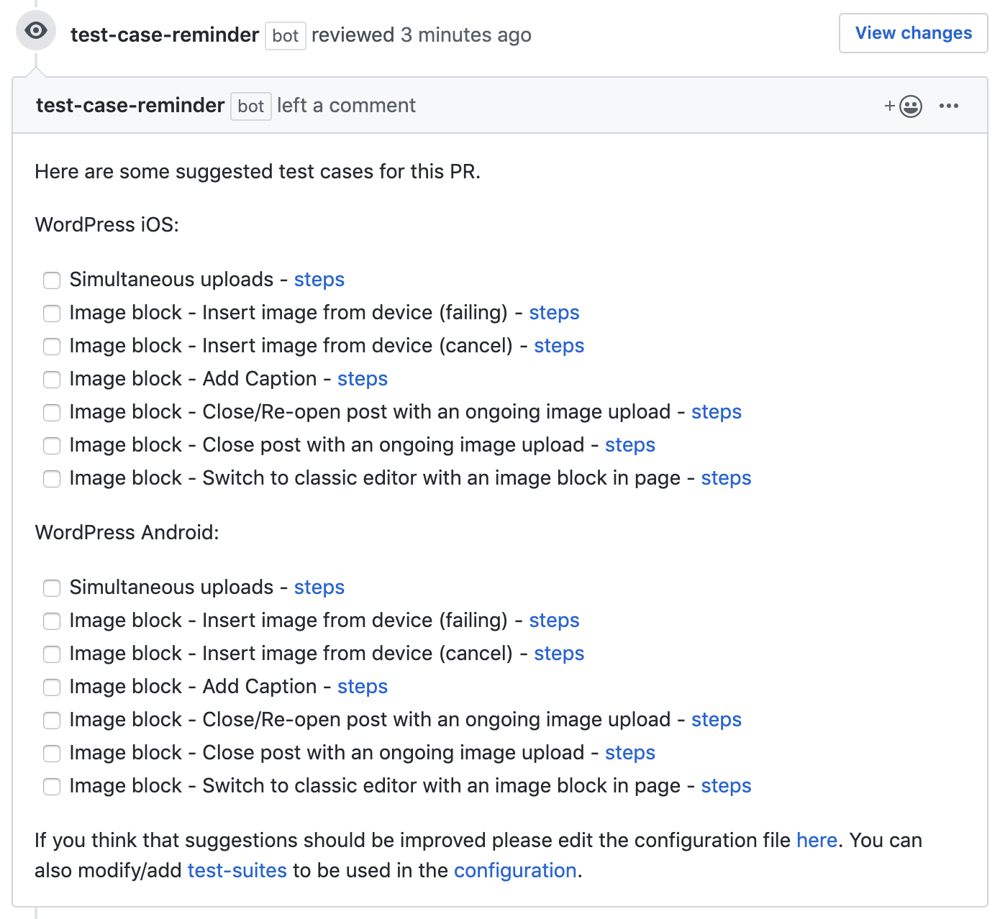

# Test Case Reminder Bot

A GitHub bot that drops a comment into the PR about what to test when specific files change. The bot can work on every repo that it is installed, you just need to add necessary `file <-> test-suite` mappings in the configuration [here](https://github.com/wordpress-mobile/test-cases/blob/master/config/mapping.json). Test suites and configurations live in [test-cases](https://github.com/wordpress-mobile/test-cases) repo. This is just the server implementation.

## Install

To run the code, make sure you have [Bundler](http://gembundler.com/) installed; then enter `bundle install` on the command line.

## Set environment variables

1. Create a copy of the `.env-example` file called `.env`.
2. Add your GitHub App's private key, app ID, and webhook secret to the `.env` file.

## Run the server

1. Run `ruby server.rb` on the command line.
2. View the default Sinatra app at `localhost:3000`.

## Develop

[This guide](https://developer.github.com/apps/quickstart-guides/setting-up-your-development-environment/) will walk through the steps needed to configure a GitHub App and run it on a server.

After completing the necessary steps in the guide you can use this command in this directory to run the smee client(replacing `https://smee.io/4OcZnobezZzAyaw` with your own domain):

> smee --url https://smee.io/4OcZnobezZzAyaw --path /event_handler --port 3000

## Reload Changes

If you want server to reload automatically as you save the file  you can start the server as below instead of using `ruby server.rb`:

> gem install rerun

> rerun 'ruby server.rb'

## Unit tests

Unit tests live in `unittest.rb`

If you want to test potential changes to [mapping.json](https://github.com/wordpress-mobile/test-cases/blob/master/config/mapping.json) file you can first apply the changes to `test_mapping.json` living in this repo and test in your local as explained below.

Checkout this repo
Change `test_mapping.json`
Change `unittests.rb` [this line](https://github.com/wordpress-mobile/test-case-reminder-bot/blob/e12c02305f31bf6c3c6d76f9f3d370c0b4703d3e/unittests.rb#L27) with the filenames you want to test with.
Change assertions accordingly

Run the below command to run them:

> ruby unittests.rb
